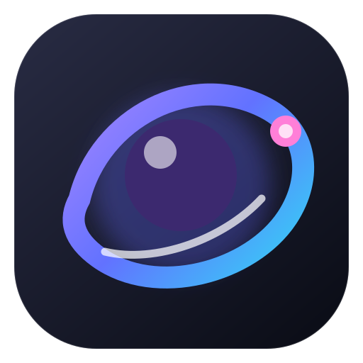

# Harness Orbit Desktop

Harness Orbit is a Windows and macOS desktop distribution of DeepSeek Harness. Electron supplies the embedded Chromium window, while the bundled `@deepseek-ai/dsh` process listens only on a dynamic `127.0.0.1` port.



## Included

- DeepSeek Harness `0.1.0-rc.6`
- Orbit plugin-first responsive interface
- Embedded Chromium desktop window
- Bundled `dsh`, `node`, and `pnpm` command shims for agent-driven plugin installation
- GitHub `dsh-plugin` marketplace link
- Workspace picker, single-instance behavior, engine restart and logs
- Per-user Windows NSIS installer and uninstaller
- Native macOS DMG builds for Apple Silicon and Intel

## Build

```powershell
npm.cmd install
npm.cmd run smoke
npm.cmd run dist:win
```

On macOS:

```bash
npm ci
npm run smoke
npm run dist:mac -- --arm64  # Apple Silicon
# npm run dist:mac -- --x64  # Intel
```

The bundled native modules provide Windows prebuilds, so the package does not require a Visual Studio toolchain.

Unsigned installers are written to `dist/`. A public macOS release should be signed and notarized with an Apple Developer ID before broad distribution.

## Release

Push a version tag to build and publish the Windows installer automatically:

```powershell
git tag v0.2.1
git push origin v0.2.1
```

The included GitHub Actions workflow also supports manual runs from the Actions tab. It builds Windows x64, macOS arm64, and macOS x64 on their native GitHub-hosted runners. Installers belong in GitHub Releases rather than Git history because they exceed GitHub's regular file-size limit.
